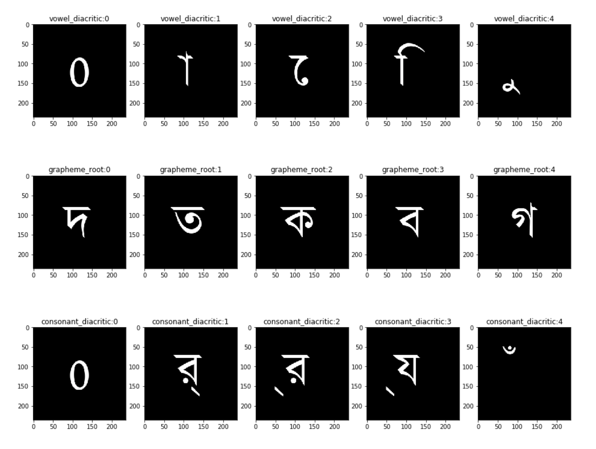

# Bengali.AI Handwritten Grapheme Classification

This was a [Kaggle competition](https://www.kaggle.com/c/bengaliai-cv19/data). Its like MNIST but more fun. There are 200k images and each letter has to be classified into 3 different categories. These are:

- grapheme (168 classes)
- vowel (11 classes)
- consonant (7 classes)

## Model

I use a pre-trained efficientnet v0 (my GPU is small) with a conv multi head. I resize the images to **(68, 118)** to make training faster. I use 20% for validation and archieve a val accuruacy of 95%. I did not submit on Kaggle because you have to create a new Notebook and submit from there and I'm too lazy for that.

And I use PyTorch Lightning for training which is amazing.

The pretrained model is in `/model` so you can try it out.